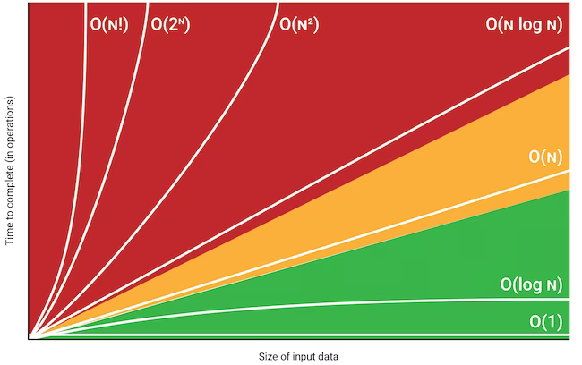

<!-- ABOUT THE PROJECT -->

## About The Project



# Analysis of Computer Algorithms (CSCE 5150)

This repository contains coursework, notes, algorithm implementations, and supporting materials for **CSCE 5150 – Analysis of Computer Algorithms** at the University of North Texas.

CSCE 5150 is a graduate-level course focused on the **design and analysis of algorithms**, with emphasis on theoretical analysis, correctness proofs, standard algorithm design strategies, and the application of those strategies to computational problems.

## Course Overview

The course develops the mathematical and analytical tools needed to evaluate algorithms and design efficient solutions. Topics progress from asymptotic analysis and recurrence relations into major algorithmic paradigms such as divide-and-conquer, greedy algorithms, and dynamic programming, followed by graph algorithms, network flows, approximation algorithms, and a tentative introduction to linear programming.

### Course Topics

1. **Worst-Case Analysis & Growth of Functions** – Asymptotic analysis and comparison of algorithm growth rates.
2. **Recurrence Relations** – Analysis of recursive algorithms using recurrence equations.
3. **Divide and Conquer** – Breaking problems into smaller subproblems, solving them recursively, and combining their solutions.
4. **Lower Bounds** – Establishing theoretical limits on algorithm performance.
5. **Greedy Algorithms** – Constructing solutions through locally optimal choices.
6. **Dynamic Programming** – Solving problems with optimal substructure and overlapping subproblems.
7. **Graph Algorithms & Network Flows** – Algorithms for graph traversal, shortest paths, spanning structures, and flow problems.
8. **Approximation Algorithms for NP-Hard Problems** – Developing efficient approximate solutions for computationally difficult problems.
9. **Introduction to Linear Programming** – Optimization using linear objective functions and constraints (tentative).

## Course Focus

The course emphasizes:

* Analyzing worst-case algorithm performance and growth rates.
* Formulating and solving recurrence relations.
* Understanding and applying standard algorithm design paradigms.
* Developing and reasoning about correctness proofs.
* Applying greedy and dynamic programming strategies.
* Analyzing graph and network-flow algorithms.
* Understanding lower bounds and computational complexity considerations.
* Exploring approximation techniques for NP-hard problems.
* Applying algorithmic concepts through written and programming exercises.

---

<p align="right">(<a href="#readme-top">back to top</a>)</p>

### Built With

Programming assignments may use Python and Jupyter notebooks where appropriate.

* [![Python][Python.org]][Python-url]
* [![Jupyter][Jupyter.org]][Jupyter-url]
* [![Docker][Docker.com]][Docker-url]

<!-- GETTING STARTED -->

## Getting Started

The repository can be used to organize implementations, homework exercises, study materials, and examples related to the algorithms covered throughout the course.

### Prerequisites

1```

## Recommended Textbooks

* Thomas H. Cormen, Charles E. Leiserson, Ronald L. Rivest, and Clifford Stein. **Introduction to Algorithms**, 3rd ed.
* Mark A. Weiss. **Data Structures and Algorithm Analysis in C++**. Pearson, 2013.

<!-- ACKNOWLEDGEMENT -->

## Acknowledgements

* Dr. Haili Wang – CSCE 5150, University of North Texas.
* Cormen, Leiserson, Rivest, and Stein – *Introduction to Algorithms*, 3rd ed.
* Mark A. Weiss – *Data Structures and Algorithm Analysis in C++*.

<!-- CONTACT -->

## Contact

[Larry Johnson](mailto:johnson.larry.l@gmail.com)

<br>

<p align="right">(<a href="#readme-top">back to top</a>)</p>

<!-- MARKDOWN LINKS & IMAGES -->
<!-- https://www.markdownguide.org/basic-syntax/#reference-style-links -->

[Python-url]: https://python.org
[Python.org]: https://img.shields.io/badge/Python-3776AB?style=for-the-badge&logo=python&logoColor=white

[Jupyter-url]: https://jupyter.org
[Jupyter.org]: https://img.shields.io/badge/Jupyter-F37626.svg?&style=for-the-badge&logo=Jupyter&logoColor=white

[Docker-url]: https://www.docker.com/
[Docker.com]: https://img.shields.io/badge/Docker-2496ED?style=for-the-badge&logo=docker&logoColor=white